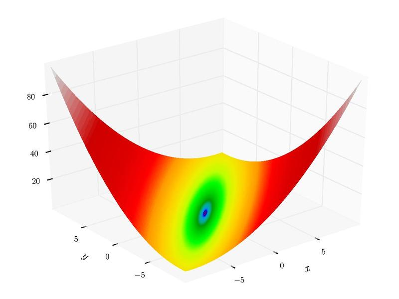
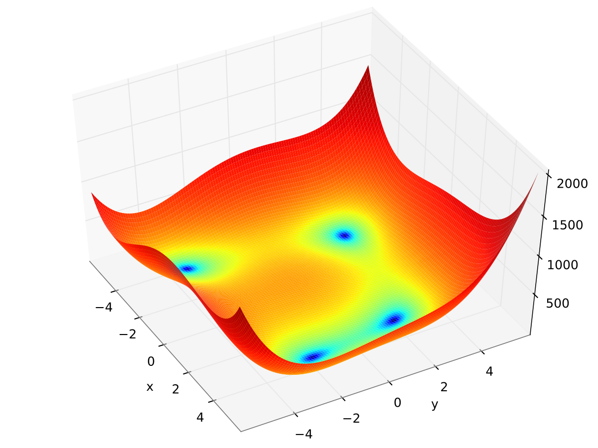
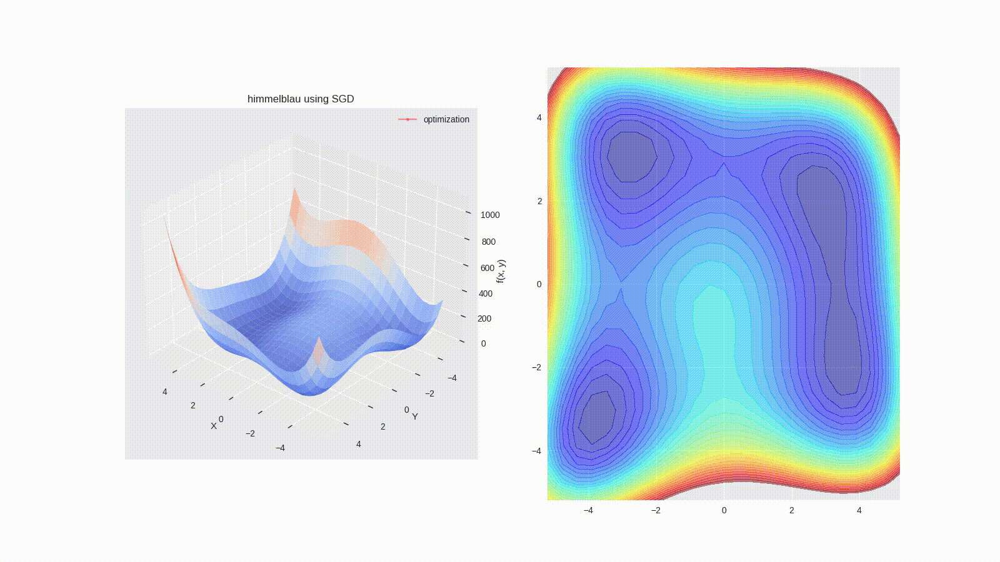
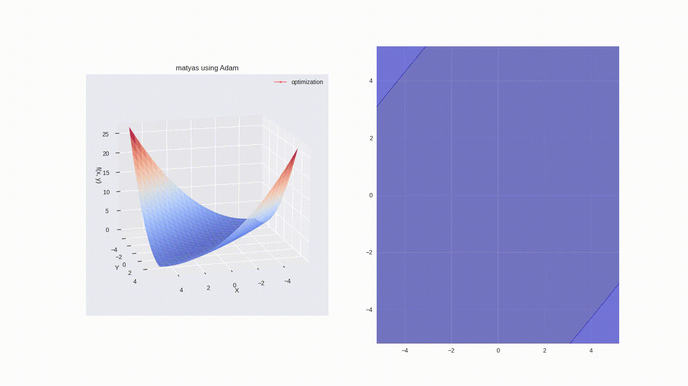

# Optimizers Visualized

Visualization of how different optimizers handle mathematical functions for optimization.

## Contents

- [Installation](#installation-of-libraries)
- [Usage](#usage)
- [Functions for optimization](#functions-for-optimization)
- [Visualization of optimizers](#visualization-of-optimizers)
- [Links](#links)
- [TODO](#todos)

## Installation of libraries

`pip install -r requirements.txt`

> NOTE: The optimizers used in this project are the pre-written ones in the pytorch module.

## Usage

`python main.py`

The project is designed to be interactive, making it easy for the user to change any default values simply using `stdin`.

## Functions for optimization

### Matyas' Function

This is a relatively simple function for optimization.

Source: https://en.wikipedia.org/wiki/File:Matyas_function.pdf

### Himmelblau's Function

A complex function, with multiple global minimas.

Source: https://en.wikipedia.org/wiki/File:Himmelblau_function.svg

## Visualization of optimizers

All optimizers were given 100 iterations to find the global minima, from a same starting point. Learning rate was set to 0.1 for all instances, except when using SGD for minimizing Himmelblau's function.

### Stochastic Gradient Descent

The vanilla stochastic gradient descent optimizer, with **no** additional functionalities:

`theta_t = theta_t - lr * gradient`

#### SGD on Matyas' function

We can see that SGD takes an almost direct path downwards, and then heads towards the global minima.

#### SGD on Himmelblau's function

SGD on Himmelblau's function fails to converge even when the learning rate is reduced from 0.1 to 0.03.

It only converges when the learning rate is further lowered to 0.01, still overshooting during the early iterations.

### Root Mean Square Propagation

RMSProp with the default hyperparameters, except the learning rate.

#### RMSProp on Matyas' function

RMSProp first reaches a global minima in one dimension, and then switches to minimizing another dimension. This can be hurtful if there are saddle points in the function which is to be minimized.

#### RMSProp on Himmelblau's function

By trying to minimize one dimension first, RMSProp overshoots and has to return back to the proper path. It then minimizes the next dimension.

### Adaptive Moment Estimation

Adam optimizer with the default hyperparameters, except the learning rate.

#### Adam on Matyas' function

Due to the momentum factor and the exponentially weighted average factor, Adam shoots past the minimal point, and returns back.

#### Adam on Himmelblau's function

Adam slides around the curves, again mostly due to the momentum factor.

## Links

- SGD: [PyTorch SGD](https://pytorch.org/docs/stable/generated/torch.optim.SGD.html)
- RMSProp: [PyTorch RMSProp](https://pytorch.org/docs/stable/generated/torch.optim.RMSprop.html)
- Adam: [PyTorch Adam](https://pytorch.org/docs/stable/generated/torch.optim.Adam.html)

## Todos

- Add more optimizers
- Add more complex functions
- Test out optimizers in saddle points
